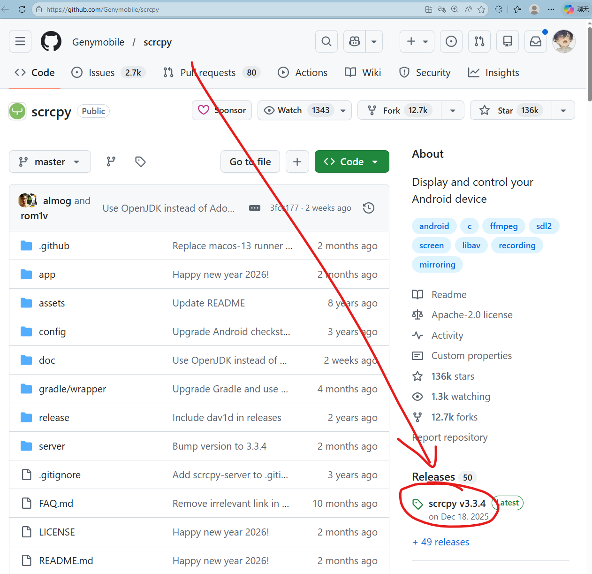
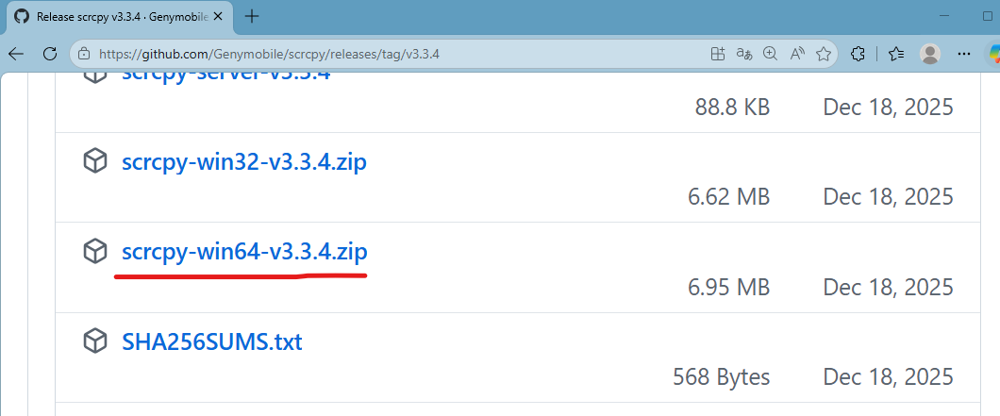
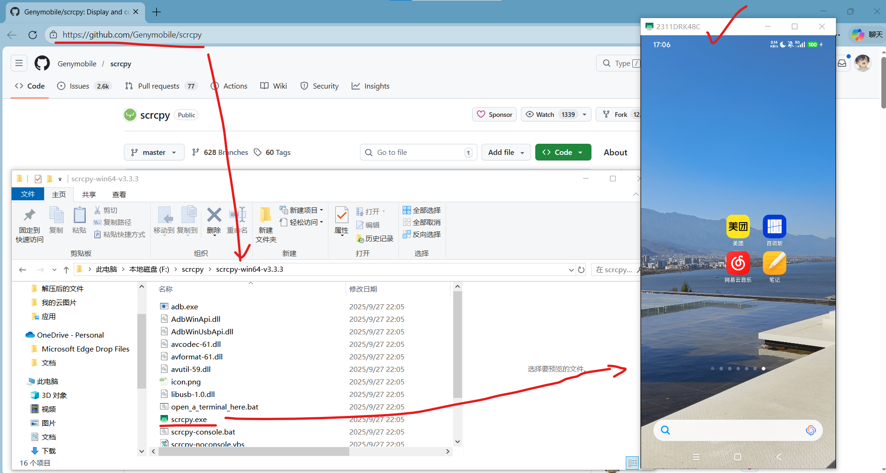
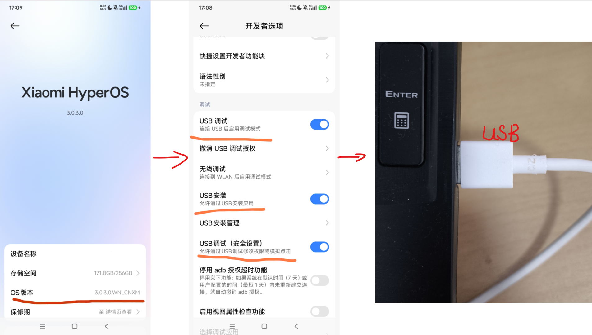
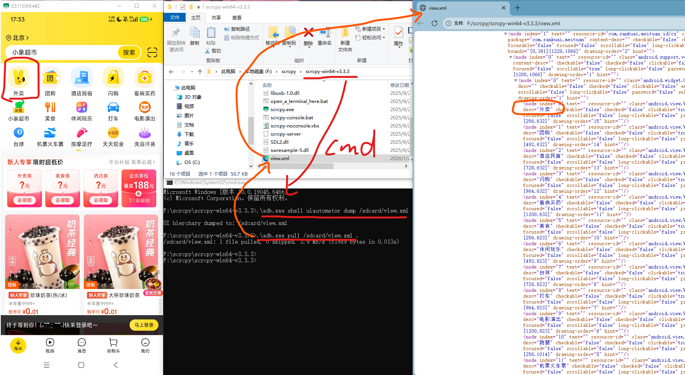
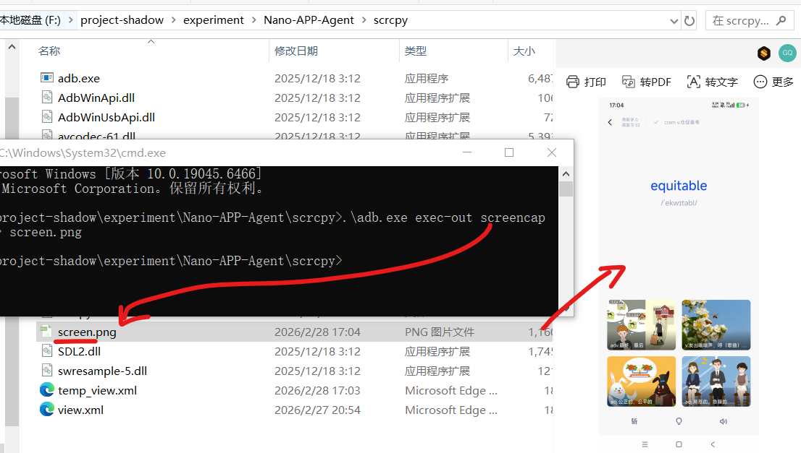
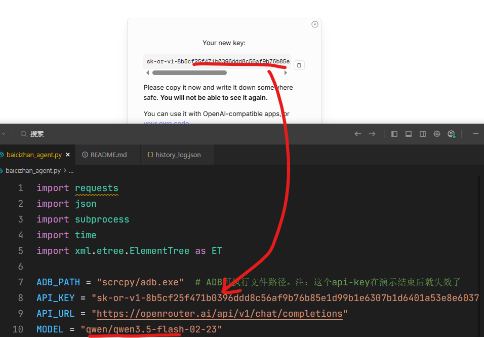
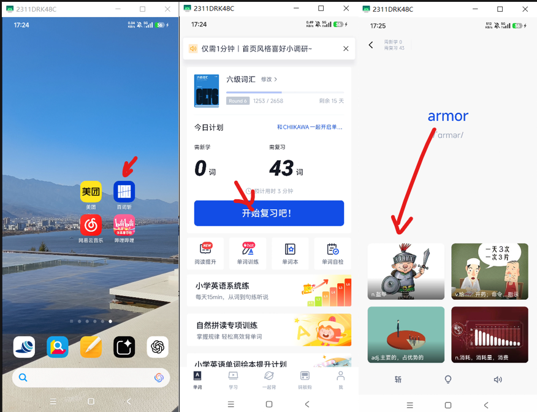

# Nano-UI-Agent

想要实现一个能自动打卡百词斩的UI Agent面临的第1个问题是如何将大模型的输出变成一种手机操作？

#### 解决方案：scrcpy







利用开源神器 **scrcpy**。它不仅能实现极低延迟的屏幕投屏，更重要的是它内置了完整的 **ADB (Android Debug Bridge)** 环境，让我们可以在电脑端直接通过命令行控制手机。

- **scrcpy 下载地址**：[https://github.com/Genymobile/scrcpy](https://github.com/Genymobile/scrcpy)
- **作用**：通过电脑查看手机实时画面，并提供数据传输与控制接口。

#### 准备工作：开启手机权限



需要在安卓手机上完成以下步骤（以常用手机为例）：
1. **开启开发者模式**：在“关于手机”中连续点击版本号，直到提示已开启。
2. **开启 USB 调试**：在开发者选项中打开，允许电脑通过数据线下发指令。
3. **开启模拟点击**：部分手机需开启 **USB 调试（安全设置）**，允许电脑模拟人工点击屏幕。
4. **开启 USB 安装（可选）**：在Android studio开发时Agent需要，使得可以将.apk通过USB线安装到手机。

#### 如何通过命令控制手机？



在`scrcpy`同级目录，打开`cmd`输入以下指令：

- **获取手机当前页面结构（XML）**：
  
  ```bash
  .\adb.exe shell uiautomator dump /sdcard/view.xml
  ```
  ```shell
  .\adb.exe pull /sdcard/view.xml .
  ```
  
  通过分析生成的 `view.xml` 文件，我们可以精准定位屏幕上任何按钮的坐标。
  
- **执行点击动作**：
  
  ```bash
  adb shell input tap 800 1200
  ```

- **番外篇**：获取当前手机截图

  ```shell
  .\adb.exe exec-out screencap -p > screen.png
  ```

  

### 获取API-key：以OpenRouter为例

- 选择**OpenRouter**是因为它对Gemini、Claude、gpt御三家支持，而七牛云和硅基流动主要只支持deepseek这类模型还有开源模型。而且现在OpenRouter买API还是方便的[可以用微信]。这里演示的时候，我就以OpenRouter为例，其他几家完全一样。

- 去这里，确保有API剩余额度。

```http
https://openrouter.ai/settings/credits
```


- 去这里创建一个api key

```http
https://openrouter.ai/settings/keys
```

- 复制api key，填入`baicizhan_agent.py`，代码默认选择的千问3.5flash最新出的一个速度快，而且比较强的模型。



### 开始打卡

需要确保，USB已经连接手机，开启了USB调试模式，手机屏幕打开，桌面上正好有一个百词斩（可能需要先打开一次，把广告给关掉，确保一进去就有一个开始打卡的按钮，因为我们的最小化实现没有那么鲁棒）。

确保api可以调用，然后在根目录运行：

```shell
python baicizhan_agent.py
```


